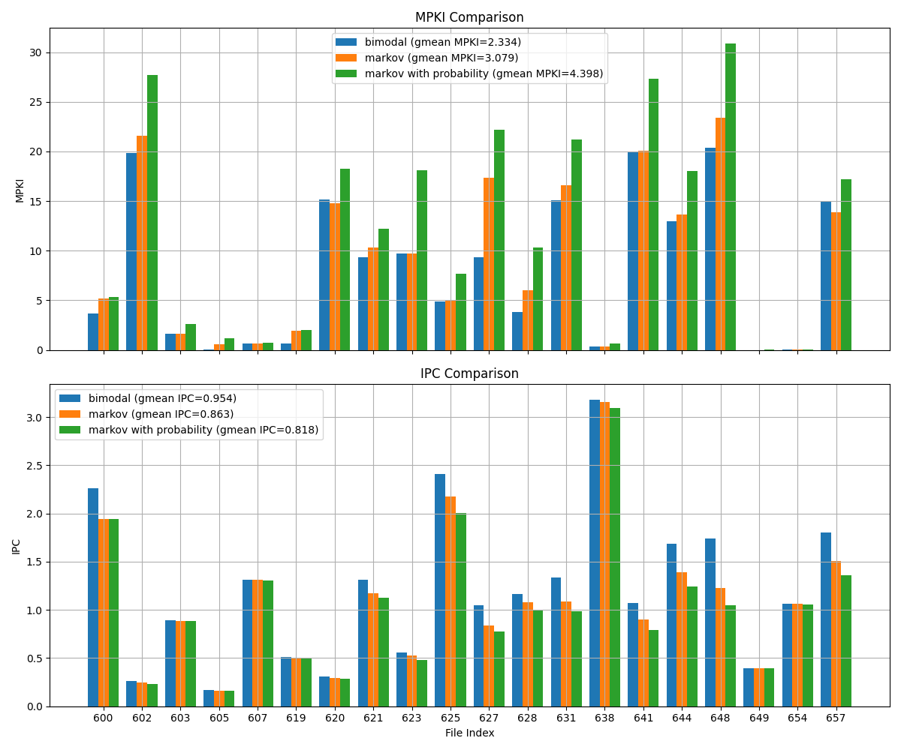
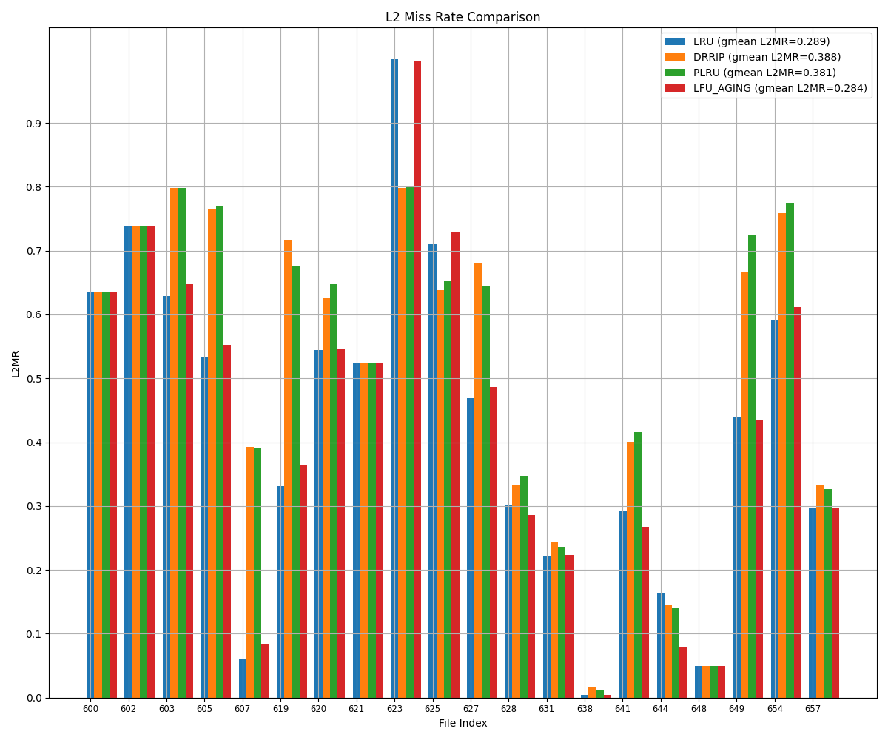

# 1. Branch predictors comparison

Results are provided on these traces:
```bash
600.perlbench_s-1273B.champsimtrace.xz  620.omnetpp_s-141B.champsimtrace.xz    631.deepsjeng_s-928B.champsimtrace.xz   654.roms_s-293B.champsimtrace.xz
602.gcc_s-1850B.champsimtrace.xz        621.wrf_s-575B.champsimtrace.xz        638.imagick_s-10316B.champsimtrace.xz   657.xz_s-4994B.champsimtrace.xz
603.bwaves_s-2931B.champsimtrace.xz     623.xalancbmk_s-165B.champsimtrace.xz  641.leela_s-149B.champsimtrace.xz       
605.mcf_s-1536B.champsimtrace.xz        625.x264_s-12B.champsimtrace.xz        644.nab_s-12459B.champsimtrace.xz
607.cactuBSSN_s-2421B.champsimtrace.xz  627.cam4_s-490B.champsimtrace.xz       648.exchange2_s-387B.champsimtrace.xz
619.lbm_s-2676B.champsimtrace.xz        628.pop2_s-17B.champsimtrace.xz        649.fotonik3d_s-1176B.champsimtrace.xz
```

## Expected result:

| Policy | MPKI | IPC | Why? | 
| --- | --- | --- | --- | 
| **Bimodal** | Highest | Lowest | Simple static prediction, bad for dynamic branches. | 
| **Markov** | Middle | Middle | Better modeling of sequence-dependent branches. | 
| **Markov with probability** | Lowest | Highest | 	Even models randomness and uncertainty in branch behavior. |

## Statistics

3 predictors stats on given benchmarks: `bimodal`, `markov` and `markov with probability`:



## Results:

| Policy | MPKI | IPC | Why? | 
| --- | --- | --- | --- | 
| **Bimodal** | Lowest | Highest | Simple branches, simple predictor wins. | 
| **Markov** | Middle | Middle | Adds complexity, but doesn't fully help. | 
| **Markov with probability** | Highest | Lowest | Overfits/noise, complexity penalty, too slow to adapt. |

Expected results don't match current results. This could be on many reasons, for instance:
- If branches are mostly "true" or mostly "false" bimodal can perform very well;
- Markov tables are too small;
- The extra complexity of such predictor hurt more than help.


# 2. L2 replacement policies.

4 policies will be compared:
-  LRU (Least Recently Used)
Tracks when each cache block was last accessed. On eviction, it selects the block not used for the longest time.
-  PLRU (Pseudo LRU)
Uses a binary tree of bits to approximate LRU behavior with less metadata. Each bit points to the less recently used subtree.
- LFU with Aging
Each block has a usage counter. On hit, increment it; periodically, all counters are halved. This allows frequently used blocks to stay, but "forgets" old usage.
- DRRIP (Dynamic Re-reference Interval Prediction)
Uses a prediction counter to decide between SRRIP (static) and BRRIP (bimodal) policies dynamically. Balances recency vs. reuse behavior.

## Expected result:

| Policy    | Hit Rate (↑ = better)   |  
| --------- | ----------------------- | 
| LRU       | ↑↑ (on temporal reuse)  | 
| PLRU      | ↑                       |
| LFU_Aging | ↑↑ (on stable patterns) |
| DRRIP     | ↑↑↑ (adaptive)          | 




## Results:

| Policy    | gmean L2 Miss Rate  | 
| --------- | ------------------- |
| LRU       | 0.289  |
| PLRU      | 0.381  |
| LFU_Aging | 0.284  |
| DRRIP     | 0.388  |

Results are non-theoretically expected. LFU_aging and LRU are much better than DRRIP and PLRU. Looks like benchmarks data shows strong temporal and stable reuse.

# 3. Theoretical minimum.

## Introduction:

#### 1. Formulas for Performance, Power/Dynamic Power:

##### Golden rule of CS:
```math
Performance = \dfrac{1}{Time} = \dfrac{1}{N_{instrs} \cdot CPI \cdot T_{cycle}} = \dfrac{1}{N_{instrs}} \cdot IPC \cdot f,
```
here $`N_{instrs}`$ is number of instructions, $`IPC`$ is number of instructions per cycle and $`f`$ is a frequency. $`N_{instrs}`$ parameter depends on SW algorithms, ISA, while $`f`$ depends on better circuits, transistors.

```math
Power = Power_{dynamic} + Power_{static} = C \cdot V^2 \cdot f + leakage,
```
here $`C`$ is capacitance, $`V`$ is voltage and $`f`$ is a frequency

#### 2. Moore's law and Dennard scaling:

##### Moore's Law(1965): The number of transistors on integrated circuits doubles approximately every 18 months(from 1975, it's 2 years).
That is to say - tech advancements allow to increase transistor's resolution without increasing cost. Number of transistors increases, while absolute size of die doesn't change.

##### Dennard scaling(1974): With each technology generation, as transistors get smaller, power consumption per unit area remains the same. Both voltage and current scale downward with transistor length.
Transistors size and voltage and power decrease proportionally. Power density remains the same. Thus we could increase frequency without thermal issues.

#### 3. Dennard scaling ending(2005).
Ended due to physical limitations: voltage could not be reduced as fast as transistor sizes → density increase → thermal issues.

After Dennard scaling ending, developers began to look for alternative ways of performance improvement, such as multicore architectures, improved parallelism, and the use of specialized processors(GPU).

#### 4. Bypassing/Data forwarding optimization.
Let's take a look into these 2 instructions coming one after another:
```
i1. add x2, x1, x0
i2. add x3, x2, x4
```
After `execution` stage of `i1`, we already know the value of `x2`. Thus we can optimize and bypass the value of `x2`, without waiting for `writeback` stage. Moreover, it decreases the amount of stalls.

Use the value before it is written back to register file. `Forwarding Unit` implementation needed for such optimization to work in the pipeline [(simplest pipeline with Forwarding Unit exapmle)](theor_min_images/01.04.Pipeline_with_Forwarding_Unit.jpg).

#### 5. Instruction-Level Parallelism(ILP) and optimisations for ILP increase.
Instruction-Level Parallelism (ILP) refers to the ability of a processor to execute multiple instructions simultaneously.

Here are optimisations listed:

- 1. Superscalar architecture. Such architecture allows multiple instructions to be issued and executed in parallel during a single clock cycle. This is achieved by having multiple execution units within the processor, such as ALUs, FPUs, and load/store units.

- 2. VLIW (Very Long Instruction Word). VLIW architecture bundles multiple operations into a single long instruction word that is executed in parallel.

- 3. Vector CPUs. Vector CPUs are designed to perform operations on entire arrays or vectors of data in a single instruction. 