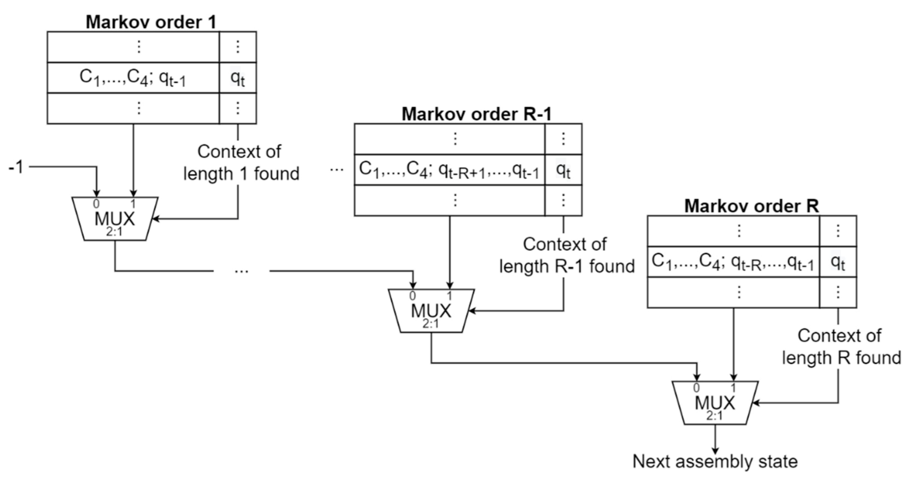
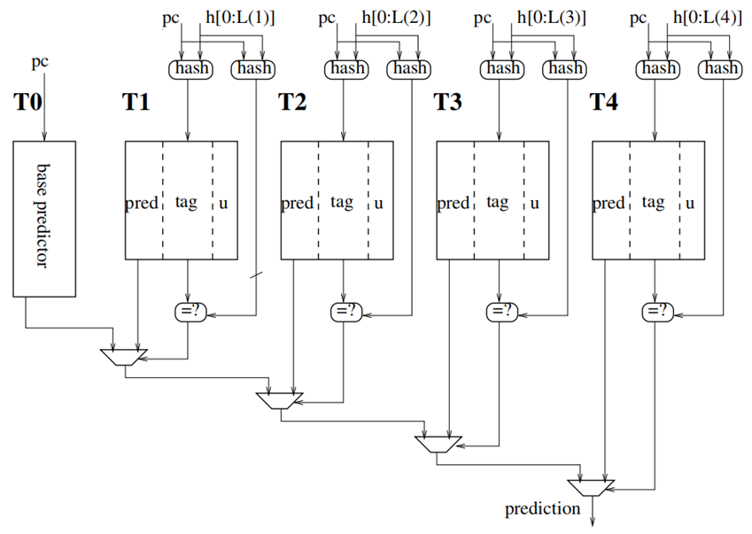
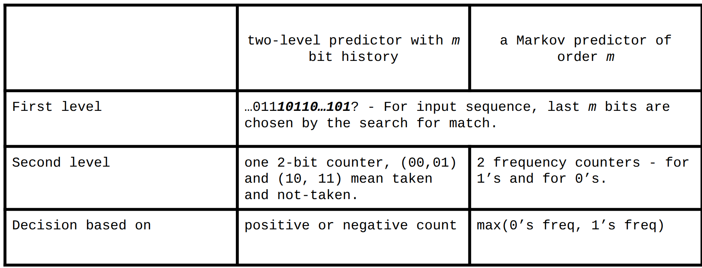
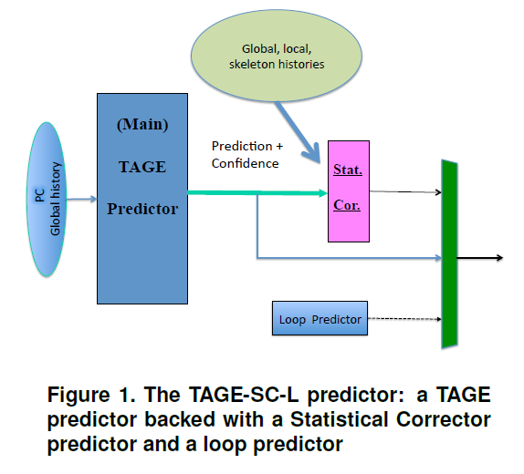
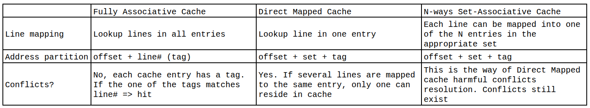
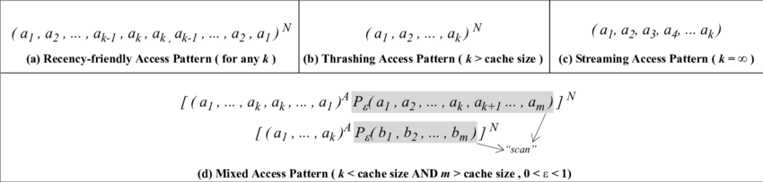
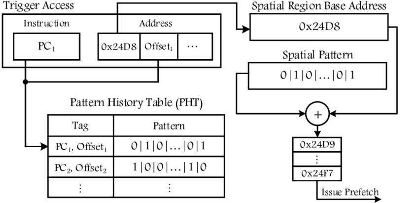
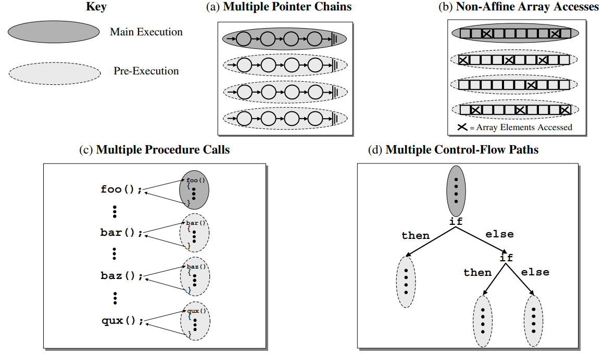
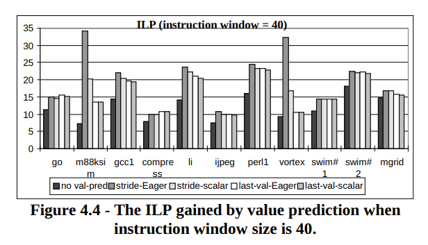
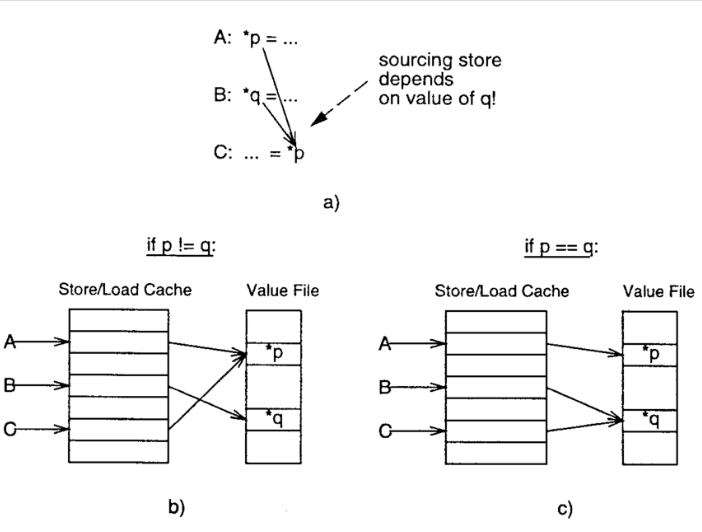

# 1. Branch predictors comparison

Results are provided on these traces:
```bash
600.perlbench_s-1273B.champsimtrace.xz  620.omnetpp_s-141B.champsimtrace.xz    631.deepsjeng_s-928B.champsimtrace.xz   654.roms_s-293B.champsimtrace.xz
602.gcc_s-1850B.champsimtrace.xz        621.wrf_s-575B.champsimtrace.xz        638.imagick_s-10316B.champsimtrace.xz   657.xz_s-4994B.champsimtrace.xz
603.bwaves_s-2931B.champsimtrace.xz     623.xalancbmk_s-165B.champsimtrace.xz  641.leela_s-149B.champsimtrace.xz       
605.mcf_s-1536B.champsimtrace.xz        625.x264_s-12B.champsimtrace.xz        644.nab_s-12459B.champsimtrace.xz
607.cactuBSSN_s-2421B.champsimtrace.xz  627.cam4_s-490B.champsimtrace.xz       648.exchange2_s-387B.champsimtrace.xz
619.lbm_s-2676B.champsimtrace.xz        628.pop2_s-17B.champsimtrace.xz        649.fotonik3d_s-1176B.champsimtrace.xz
```

## Expected result:

| Policy | MPKI | IPC | Why? | 
| --- | --- | --- | --- | 
| **Bimodal** | Highest | Lowest | Simple static prediction, bad for dynamic branches. | 
| **Markov** | Middle | Middle | Better modeling of sequence-dependent branches. | 
| **Markov with probability** | Lowest | Highest | 	Even models randomness and uncertainty in branch behavior. |

## Statistics

3 predictors stats on given benchmarks: `bimodal`, `markov` and `markov with probability`:


## Results:

| Policy | MPKI | IPC | Why? | 
| --- | --- | --- | --- | 
| **Bimodal** | Lowest | Highest | Simple branches, simple predictor wins. | 
| **Markov** | Middle | Middle | Adds complexity, but doesn't fully help. | 
| **Markov with probability** | Highest | Lowest | Overfits/noise, complexity penalty, too slow to adapt. |

Expected results don't match current results. This could be on many reasons, for instance:
- If branches are mostly "true" or mostly "false" bimodal can perform very well;
- Markov tables are too small;
- The extra complexity of such predictor hurt more than help.


# 2. L2 replacement policies.

4 policies will be compared:
-  LRU (Least Recently Used)
Tracks when each cache block was last accessed. On eviction, it selects the block not used for the longest time.
-  PLRU (Pseudo LRU)
Uses a binary tree of bits to approximate LRU behavior with less metadata. Each bit points to the less recently used subtree.
- LFU with Aging
Each block has a usage counter. On hit, increment it; periodically, all counters are halved. This allows frequently used blocks to stay, but "forgets" old usage.
- DRRIP (Dynamic Re-reference Interval Prediction)
Uses a prediction counter to decide between SRRIP (static) and BRRIP (bimodal) policies dynamically. Balances recency vs. reuse behavior.

## Expected result:

| Policy    | Hit Rate (↑ = better)   |  
| --------- | ----------------------- | 
| LRU       | ↑↑ (on temporal reuse)  | 
| PLRU      | ↑                       |
| LFU_Aging | ↑↑ (on stable patterns) |
| DRRIP     | ↑↑↑ (adaptive)          | 


## Results:

| Policy    | gmean L2 Miss Rate  | 
| --------- | ------------------- |
| LRU       | 0.289  |
| PLRU      | 0.381  |
| LFU_Aging | 0.284  |
| DRRIP     | 0.388  |

Results are non-theoretically expected. LFU_aging and LRU are much better than DRRIP and PLRU. Looks like benchmarks data shows strong temporal and stable reuse.

# 3. Theoretical minimum.

## Introduction:

#### 1. Formulas for Performance, Power/Dynamic Power:

##### Golden rule of CS:
```math
Performance = \dfrac{1}{Time} = \dfrac{1}{N_{instrs} \cdot CPI \cdot T_{cycle}} = \dfrac{1}{N_{instrs}} \cdot IPC \cdot f,
```
here $`N_{instrs}`$ is number of instructions, $`IPC`$ is number of instructions per cycle and $`f`$ is a frequency. $`N_{instrs}`$ parameter depends on SW algorithms, ISA, while $`f`$ depends on better circuits, transistors.

```math
Power = Power_{dynamic} + Power_{static} = C \cdot V^2 \cdot f + leakage,
```
here $`C`$ is capacitance, $`V`$ is voltage and $`f`$ is a frequency

#### 2. Moore's law and Dennard scaling:

##### Moore's Law(1965): The number of transistors on integrated circuits doubles approximately every 18 months(from 1975, it's 2 years).
That is to say - tech advancements allow to increase transistor's resolution without increasing cost. Number of transistors increases, while absolute size of die doesn't change.

##### Dennard scaling(1974): With each technology generation, as transistors get smaller, power consumption per unit area remains the same. Both voltage and current scale downward with transistor length.
Transistors size and voltage and power decrease proportionally. Power density remains the same. Thus we could increase frequency without thermal issues.

#### 3. Dennard scaling ending(2005).
Ended due to physical limitations: voltage could not be reduced as fast as transistor sizes → density increase → thermal issues.

After Dennard scaling ending, developers began to look for alternative ways of performance improvement, such as multicore architectures, improved parallelism, and the use of specialized processors(GPU).

#### 4. Bypassing/Data forwarding optimization.
Let's take a look into these 2 instructions coming one after another:
```
i1. add x2, x1, x0
i2. add x3, x2, x4
```
After `execution` stage of `i1`, we already know the value of `x2`. Thus we can optimize and bypass the value of `x2`, without waiting for `writeback` stage. Moreover, it decreases the amount of stalls.

Use the value before it is written back to register file. `Forwarding Unit` implementation needed for such optimization to work in the pipeline [(simplest pipeline with Forwarding Unit exapmle)](theor_min_images/01.04.Pipeline_with_Forwarding_Unit.jpg).

#### 5. Instruction-Level Parallelism(ILP) and optimisations for ILP increase.
Instruction-Level Parallelism (ILP) refers to the ability of a processor to execute multiple instructions simultaneously.

Here are optimisations listed:

- 1. Superscalar architecture. Such architecture allows multiple instructions to be issued and executed in parallel during a single clock cycle. This is achieved by having multiple execution units within the processor, such as ALUs, FPUs, and load/store units.

- 2. VLIW (Very Long Instruction Word). VLIW architecture bundles multiple operations into a single long instruction word that is executed in parallel.

- 3. Vector CPUs. Vector CPUs are designed to perform operations on entire arrays or vectors of data in a single instruction. 

## Out-of-Order:

#### 1. Reorder Buffer (ROB):

In-Order Superscalar processors are limited by dependency stalls. Thus Out-of-Order(O3) CPU appeared - execute independent instructions out of program order. To execute them, instructions are put into buffer (which is ROB). Then those instructions are checked for dependencies, and independent will be executed.

#### 2. Why not huge ROB (1e4 cells) if we have enough power/area to be occupied?

ROB has it's limitations - branches and exceptions. Branches are resolved with branch predictors, but there still exist a probability of N_th instruction removal. For instance, if branch predictor has accuracy `90%`, the probability of `100th` instruction not to be removed will be `12%`. If any exception occurs - the fault will be handled, but the ROB will be flushed. Firstly, re-fetching will take a lot of time, if buffer is huge. Secondly, there are 2 searches: at allocation(per instruction) - identifying producers of the instruction sources; at scheduling(per cycle) - to identify ready instructions and send them to execution. These 2 searches loose potential performance usually, if ROB is too huge - performance lost is even bigger.

#### 3. Eliminating False/Anti- Dependencies in registers. Register Aliases Table(RAT):

Let's take a look into these 2 instructions coming one after another:
```
i1. r1 <- r4 / r7
i2. r8 <- r1 + r2
i3. r1 <- r5 + 1
i4. r6 <- r6 - r3
i5. r6 <- load[r1 + r6]
i6. r7 <- r8 * r4
```

It's easy to note that `r1` from `i3` can be executed independently from `r1` from `i1` and `i2`. ISA registers number limitation can be fixed with simplest renaming due to the fact that HW can contain more registers in the speculative state than ISA. For instance, we can make such a renaming and now execute `i3` independently from `i1`.
```
i1. pr1 <- pr4 / pr7
i2. pr8 <- pr1 + pr2
i3. pr10 <- pr5 + 1
i4. pr6 <- pr6 - pr3
i5. pr6 <- load[pr10 + pr6]
i6. pr7 <- pr8 * pr4
```

Renaming has requirements: producer and all its consumers are renamed to the same physical register; producer writes to the original arch register at retirement. When renaming, results should be put into RAT. Each ROB entry saves previous register alias, which is history. On flush, ROB restores history.

#### 4. Scheduler Queue:

ROB has 2 complex searches: at allocation(per instruction) - identifying producers of the instruction sources; at scheduling(per cycle) - to identify ready instructions and send them to execution. For preventing potential performance loss, it would be better to check only not completed instructions. They are put into Scheduler Queue, which is smaller than ROB size (20-30%).

Instructions are deleted from the ROB during the commit stage after they have been executed and when it is their turn in program order. They can also be deleted during flush operations due to exceptions or mispredictions. Instructions are deleted from the Scheduler Queue when they are dispatched to execution units for execution, based on operand availability and resource availability.

#### 5. Memory Disambiguation problem and how to solve it:

O3 engine tracks registers dependency, but not through memory:
```
i1. Mem[r1] <- ...
...
iN. ... <- Mem[r1]
```
If `iN` executes before `i1`, wrong value from memory will be read.

Moreover, such a case can appear, where `r2` and `r3` are the same values:
```
i1. Mem[r2] <- ...
...
iN. ... <- Mem[r3]
```

This is the Memory Disambiguation problem. How to solve it? Rules should be applied to the store/load instructions.
Architecturally:
- Implement Load and Store Buffers. Same as Scheduler Queue, but for Load/Stores only.
- Apply store forwarding. Load can take data of the producing store bypassing cache.
Rules for stores and loads + false dependencies resolution needed:
Stores: 1. Never performed speculatively; 2. Never re-ordered among themselves; 3. Store commits its value to cache post retirement.
Loads: 1. No dependency from store - execute ASAP. 2. Forwardable dependency from store - take data from that store. 3. Non-forwardable dependency from store - wait for the cache update.

#### 6. Store instruction -> STA (store address calculation) and STD(store data calculation):

False dependency: Data is not required to check if store and load have dependency. Address is calculated when store is executed. But store is sent to execution only all its sources (including both address and data) are ready to execute.

```
i1. r1 <- ...
i2. r2 <- ...
i3. Mem[r1] <- r2
...
iN. ... <- Mem[r3]
```
`i3` and `iN` don't overlap! But `iN` waits for `i2`. That's false dependency.

To remove false dependencies in case of absence of overlapping, store instruction is executed in 2 steps: STA; STD. Load is waiting for STD only if overlapped with STA.

#### 7. Load speculation optimisation:

Load has to wait for older STAs. Same to the branches speculation, we can speculate on store-load dependencies adding correctness check of load speculation in the LB and SB. That is called speculation prediction. History should be tracked too (as same as it is in branch prediction). Speculation prediction policies can differ in working with unknown loads. Unknown loads can be assumed as speculative or as non-speculative. Speculative unknown loads need "blacklist", where incorrect assumptions PC should be put. Rollbacks give big overhead. If unknown loads are non-speculative, "whitelist" needed with correct assumptions(no STAs to wait). Cons are that loads wait STAs at the beginning, which is overhead. 

## Branch Prediction:

#### 1. Branch Target Buffer (BTB) - what information does it store?

BTB is used for predicting direct and indirect branches, being organized as a cache. IP(for found branches) -> PC.

#### 2. State-of-the-art conditional branch predictor at 2025 (before 6th Championship Branch Prediction (CBP2025)):

This is `PPM` predictor:



State-of-the-art predictors are based on `TAGE`(TAgged GEometric history length) nowadays: `original TAGE`, `BATAGE`, `TAGE-SC-L`: 



`TAGE` is N-component PPM-like predictor, but with its own key features:
- The history lengths used for tables `T1`, `T2`, ... have the form $`L(i)=a^{i-1} \cdot L(1)`$, forming geometric series.
- Consideration of not only the longest matching path(pred), but also the second longest matching (altpred);
- For tackling the cold counter problem, a tiny meta-predictor selects the final prediction beteen pred and altpred(depedns on the state of pred up/down counter);
- Each tagged entry has `u` counter;
- Pred entry is considered useful when it prevents the occurence of misprediction;
- `u` counter is decreased periodically (needed for dead entries to be excluded);
- `TAGE` allocates a single entry per misprediction.

#### 3. Real-life task:

A processor uses a two-level adaptive conditional branch predictor:
- Global history: The predictor keeps track of the directions of the last branches using a 3-bit Branch History Register (BHR).
- Pattern History Table (PHT): It has 8 entries (since $`2^3 = 8`$, one for each possible BHR pattern).
- Each PHT entry is a 2-bit saturating counter, initially set to "Strongly not taken" (00).

To calculate the misprediction rate of this predictor for the following loop:
```cpp
for (int i = 0; i < 100; ++i)
    std::cout << i << "\n";
```
1. Global history (BHR) tracks the last 3 branch outcomes. => It's a 3-bit shift register.
2. PHT counters are indexed by BHR.
3. Possible states for PHT entry are `"Strongly not taken"(00)`, `"Weakly not taken"(01)`, `"Weakly taken"(10)`, `"Strongly taken"(11)`.

Current program has 101 branches. Assuming that branch sequence got from the compiler is: 1, 1, 1, ..., 1 (100 times), then 0, at exit. Let's build the table:

| Iteration (i) | BHR (3-bit) | PHT Entry (BHR)  | Prediction | Actual Outcome | Misprediction? | Update PHT (BHR) | Update BHR (Shift)           |
|:-------------:|:-----------:|:----------------:|:----------:|:--------------:|:--------------:|:----------------:|:----------------------------:|
|             0 |         000 | 00 (Strongly NT) | 0          | 1              | +              | 00 -> 01         | 000 -> 001                   |
|             1 |         001 | 00 (Strongly NT) | 0          | 1              | +              | 00 -> 01         | 001 -> 011                   |
|             2 |         011 | 00 (Strongly NT) | 0          | 1              | +              | 00 -> 01         | 011 -> 111                   |
|             3 |         111 | 00 (Strongly NT) | 0          | 1              | +              | 00 -> 01         | 111 -> 111                   |
|             4 |         111 | 01 (Weakly NT)   | 0          | 1              | +              | 01 -> 10         | 111 -> 111                   |
|             5 |         111 | 10 (Weakly T)    | 1          | 1              | -              | 10 -> 11         | 111 -> 111                   |
|             6 |         111 | 11 (Strongly T)  | 1          | 1              | -              | 11 -> 11         | 111 -> 111                   |
| ... (7 to 99) | ...         | ...              | ...        | ...            | -              | 11 -> 11         | 111 -> 111                   |
|           100 |         111 | 11 (Strongly T)  | 1          | 0              | +              | 11 -> 10         | 111 -> 110                   |

Thus, number of mispredictions for given program is equal to `6`.
```math
Misprediction\space{}rate = \dfrac{6}{101} \approx 5.94\%
```

#### 4. Relationship between two-level adaptive branch predictor and the PPM (Prediction by Partial Matching) algorithm:

For understanding this relationship, is would be better to compare two-leevel predictor with _m_ bit history and Markov predictor of order _m_:



Both algorithms are very close and adapt dynamically to observed behaviour. But they differ in 2nd and 3rd steps of algorithm.

#### 5. Perceptron-based branch predictor:

Perceptron-based predictors are good at combining inputs of different types. `Statistical Corrector` predictor, which is perceptron-based is created for better prediction class of statistically biased branches. The correction aims at detecting the unlikely prediction and revert them.



#### 6. Types of conditional transitions are difficult to predict for the TAGE predictor:

Limitations of `TAGE`-like predictors:
- data dependent branches;
- weakly correlated branches;
- cold counter problem;
- too short history to find correlation.

#### 7. Briefly about "Branch Prediction is Not a Solved Problem":

- IPC can increase up to 20% if addressing remaining mispredictions.
- Two primary reasons for mispredictions are: systematic H2P branches and rare branches with low dynamic execution.

## Memory

#### 1. Difference between Fully Associative, Direct mapped and Set-Associative caches:



#### 2. Translation Lookaside Buffer(TLB) - what is it for:

TLB is used for fastening virtual address translation into physical. Usually TLB caches have 64-256 entries, are 2-8 way associative. TLB access time is faster than L1 cache access time.

#### 3. Granularity of replacement policies:

The decision to predict whether any given line should be allowed to stay in cache is re-evaluated during cache line lifetime. Granularity answers 2 questions: 1. At what granularity are lines distinguished at the time of insertion? Are all cache lines treated the same or not? Granularity of cache replacement policies: Coarse-grained or Fine-grained.

#### 4. Common cache access patterns:

This is the list of common cache access patterns: `Recency-Friendly`, `Thrashing`, `Streaming` and `Mixed`:



Here $`a_i`$ and $`b_i`$ represent cache line access, $`N`$ is sequence repetion, $`P_\varepsilon(a_1,...,a_k)`$ is temporal sequence that occurs with probability $`P_\varepsilon`$.

#### 5. In what way is LRU Insertion Policy (LIP) better than the classic LRU replacement policy?

LIP is based on LRU, but LIP promotion has MRU policy:

| Insertion    | Promotion    | Aging                       | Victim Selection |
|--------------|--------------|-----------------------------|------------------|
| LRU position | MRU position | Move 1 position towards LRU | LRU position     |

LIP improves upon classic LRU by reducing cache pollution for one-time accesses while preserving LRU’s benefits for reused data. It’s particularly effective in workloads where classic LRU suffers from **thrashing** (e.g., large datasets with irregular reuse).

#### 6. Why is BRRIP replacement policy resistant to scanning and thrashing patterns?

BRRIP is a probabilistic variant of RRIP (Re-Reference Interval Prediction) that:
- Assigns a re-reference interval value (RRPV) to each cache line, predicting how soon it will be reused;
- Uses bimodal insertion to handle both reused data and scanning/thrashing patterns.

| Insertion    | Promotion    | Aging                       | Victim Selection |
|--------------|--------------|-----------------------------|------------------|
| RRPV = 3 for most insertions, RRPV=2 with probability $`\varepsilon`$ | RRPV = 0 | Increment all RRPVs (if no line with RRPV = 3) | RRPV = 3     |

How BRRIP resists **scanning**, which is one-time sequential accesses problem:
    - Most new blocks are inserted with RRPV = "Distant" (RRPV=3). This marks them as low priority for retention, so they are evicted quickly.
    - Probabilistic Bimodal Insertion. A small fraction $`\varepsilon`$ of new blocks are inserted as "Near" (RRPV = 2) to avoid pathological corner cases. This prevents complete starvation of new data in edge cases.

How BRRIP resists **thrashing**, which is repeated conflicts:
    - On a cache hit, the block’s RRPV is decremented, signaling it may be reused soon. Blocks with RRPV = 0 are "high priority" and protected from eviction.
    - When eviction is needed, BRRIP evicts blocks with the highest RRPV. Thrashing patterns will have their RRPVs decremented, protecting them from eviction.

#### 7. What is the key idea behind the Hawkeye and Mockingjay replacement policies?

Key idea is that it's possible to apply `Belady's MIN` algorithm to the memory references of the past, using OPTgen. Hawkey/Mockingjay compute the optimal solution for a few sampled sets, and it introduces the OPTgen algo that computes the same answer as `Belady's MIN` policy for these sampled sets. OPTgen determines the lines that would have been cached if the MIN policy had been used.

#### 8. Spatial Memory Streaming (SMS) prefetcher - how does it work?



The Spatial Memory Streaming (SMS) prefetcher works by tracking spatial access patterns within memory regions. Here’s how it works:

- Trigger Access: An instruction (e.g., $`PC_1`$) accesses an address (0x24D8 with $`Offset_1`$).

- Pattern Recording: The PHT logs the access pattern (e.g., 0,1,0,…,0,1) for this address, marking which cache lines are accessed within a spatial region.

- Prefetch Generation: When the same $`PC_1`$ accesses the region again, SMS replays the recorded pattern and prefetches cache lines flagged as likely (1 in the bitmask) future accesses.

## Advanced Optimizations & Parallelism

#### 1. What complex cases are Execution-based Prefetchers intended to cover?

For prefetchings data, a piece of code can be pre-executed. That is the main idea of Execution-based Prefetchers. Here is a list of complex cases covered by such prefetchers:

- Multiple pointer chains;
- Non-Affine Array Accesses;
- Multiple procedure calls;
- Multiple Control-Flow Paths.



#### 2. What is Value Prediction optimization? For which instructions is this optimization typically used in modern processors?

Value prediction is the technique is designed to increase instruction-level parallelism by breaking data dependencies between instructions. Value prediction attempts to guess the result of an instruction so that subsequent instructions that depend on this value can proceed without stalling. Value prediction can be implemented via speculative thread.

Typical usage instructions:
- Load Instructions. Example: `x = arr[0]`; repeatedly returns the same value in loops;
- ALU Operations. For instance, `sum = sum + arr[i]` is often predictable.

#### 3. What is the performance gain achieved by using Value Prediction optimization?

Value Prediction can significantly increase ILP by allowing dependent instructions to execute speculatively before the actual values are computed. The performance gain from VP depends on several factors: accuracy, pipeline depth, app/benchmark. If app needs high ALU usage - VP can benefit a lot. Theoretical speedups of `>10%` have been shown in simulations.

Results from the paper `Using Value Prediction to Increase the Power of Speculative Execution Hardware`:




#### 4. What is the difference between Value Prediction and Branch Prediction in terms of the need/expected positive effect of the prediction and subsequent speculative execution in case of low confidence in the accuracy of the prediction?

Value prediction is about data prediction, branch prediction is about control flow. Value prediction is high-risk, high-reward: it can unlock parallelism but requires high accuracy to justify speculation. Branch prediction is low-risk, always-on: even imperfect predictions outperform stalling. More detaily in table:

| Feature                    | Value Prediction                                                           | Branch Prediction                                                             |
|:--------------------------:|:--------------------------------------------------------------------------:|:-----------------------------------------------------------------------------:|
| Purpose                    | Breaks data dependencies by predicting operand values.                     | Breaks control dependencies by predicting if branch taken/not taken.          |
| What is Predicted?         | Actual values.                                                             | Branch outcomes.                                                              |
| Speculative Execution      | Optional.                                                                  | Mandatory.                                                                    |
| Mispredict Penalty         | High (must squash dependent instructions + recover data state).            | Moderate (squash wrong-path instructions only).                               |
| Prediction Accuracy Needed | High (>90%) to justify speculation.                                        | Still beneficial even at lower accuracy (modern predictors achieve >95%).     |
| Example Use Case           | Predicting arr[i] in a loop with fixed stride.                             | Predicting loop exit conditions or if-else branches.                          |

#### 5. Memory renaming optimisation:

Memory Renaming is an optimization technique used in modern processors to avoid name dependencies between memory operations—specifically stores and loads—that might otherwise limit ILP.

```
A: *p = ...
B: *q = ...
C: ... = *p
```
Here sourcing store depends on value of `q`.



How does it work - applied rules for stores and loads:

- Stores:
```    
if (not in Store/Load Cache) {
    allocate store/load cache entry for store
    allocate value file entry for store result
    point store/load cache entry to value file entry
}
deposit store result into value file and memory
```

- Loads:
```
if (not in Store/Load Cache) {
    allocate store/load cache entry for load
    point store/load cache entry to value file entry of sourcing store
    if no sourcing store, insert result of load into value file
}
return value file entry as load result
```

#### 6. Difference between Fine-Grained Multithreading, Coarse-Grained Multithreading and Simultaneous Multithreading.

Key differences:
- Fine-grained
    - Cycle by cycle.
- Coarse-grained
    - Switch on event (for instance, cache miss);
    - Switch on quantum/timeout.
- Simultaneous
    - Instructions from multiple threads executed concurrenty in the same cycle.

|                                          | Fine-Grained Multithreading                                             | Coarse-Grained Multithreading      | Simultaneous Multithreading                                                                          |
|------------------------------------------|-------------------------------------------------------------------------|------------------------------------|------------------------------------------------------------------------------------------------------|
| Dependency Checking Between Instructions | No need to check                                                        | Per-thread only                    | Cross-thread                                                                                         |
| Need for Branch Prediction Logic         | No need                                                                 | Can be used                        | Highly critical                                                                                      |
| System Throughput Improvement            | Good                                                                    | Moderate                           | Best                                                                                                 |
| Hardware Complexity                      | Extra HW complexity: multiple hardware contexts, thread selection logic | A lot of HW to save pipeline state | Very High                                                                                            |
| Single-Thread Performance                | reduced                                                                 | Low single thread performance      | Can degrade                                                                                          |
| Resource Contention                      | between threads in cache in memory                                      | Low                                | High                                                                                                 |
| Thread Switching Overhead                | Minimal, but still remains                                              | Moderate                           | Utilization can be low if there are not enough instructions from a thread to "dispatch" in one cycle |
